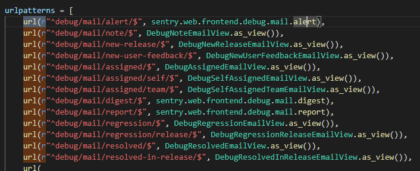
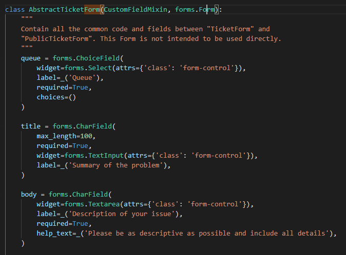

Django is the most famous python web framework. Complicated but fun to hack.

# ROUTING
Commonly, django apps has a urls.py file, which contains the endpoints that can be accessed in the website.  
Django uses 3 functions to route endpoints, ```path()```, ```re_path()```, and ```urls()```. The syntax is ```path("/endpoint", FUNCTION_TO_CALL)```  
## Examples
  
Additionally, an include can include more endpoints using the ```include()``` function Example   
```py
url(r'^helpdesk/', include('helpdesk.urls', namespace='helpdesk')),
```

# Class Based Views
In the example, you can see multiple ```as_view()``` function, this is a class based view  
These Classes Inherits from the View Class  
When the ```as_view()``` function is called, it will call ```dispatch()```, dispatch function will dispatch the request. If the request is get, it will call the ```get()``` function, if the request is post, it will call the post function.  
The flow is ```as_view()``` -> ```dispatch()``` -> ```get()```/```post()``` . Next, i will be discussing some of the builtin views of django. 

# Models
Instead of sql, Django Uses Models to store data. In django, models are classes that inherits the models.Model class. Models have fields. These are like the colums in a table when it comes to sql. For example
```py
class Queue(models.Model):
    title = models.CharField(
        _('Title'),
        max_length=100,
    )

    slug = models.SlugField(
        _('Slug'),
        max_length=50,
        unique=True,
        help_text=_('This slug is used when building ticket ID\'s. Once set, '
                    'try not to change it or e-mailing may get messy.'),
    )

    email_address = models.EmailField(
        _('E-Mail Address'),
        blank=True,
        null=True,
        help_text=_('All outgoing e-mails for this queue will use this e-mail '
                    'address. If you use IMAP or POP3, this should be the e-mail '
                    'address for that mailbox.'),
    )
```
There are multiple types of fields. Just search it up yourself. Models have alot of functions but here are the most used ones. ```save()``` is used to save a Model instace to the databse. Example  

delete() delete a model. As shown in the example, models also have an object field. This field has multiple functions like get(), and filter() which accepts a field with its value as a parmaeter and return the object with that value in the field. Example  
```python
ticket = Ticket.objects.get(id=ticket_id)
```
Here, it gets the Ticket model with the id of ticket_id

# FORMS
Form class are forms. Like models, these forms have fields.   

The fields of these forms can be propagated with the post parameters using the syntax. Forms has a method called is_valid to check if the form is valid. Additionally, we can add a Model to a form. By doing so, all of the fields of the model will be inherited by the form unless specified not to. This can be done by adding a Meta Class in the form and adding a model. Example   
```py
class TicketCCForm(forms.ModelForm):
    ''' Adds either an email address or helpdesk user as a CC on a Ticket. Used for processing POST requests. '''

    class Meta:
        model = TicketCC
        exclude = ('ticket',)
```
When we call the save function of a form, it will return an instance of the form with the propagated fields, if there is a model, it will return an instance of a model.
``` py
if request.method == 'POST':
        form = TicketCCForm(request.POST)
        if form.is_valid():
            user = form.cleaned_data.get('user')
            email = form.cleaned_data.get('email')
            if user and ticket.ticketcc_set.filter(user=user).exists():
                form.add_error('user', _('Impossible to add twice the same user'))
            elif email and ticket.ticketcc_set.filter(email=email).exists():
                form.add_error('email', _('Impossible to add twice the same email address'))
            else:
                ticketcc = form.save(commit=False)
                ticketcc.ticket = ticket
                ticketcc.save()
                return HttpResponseRedirect(reverse('helpdesk:ticket_cc', kwargs={'ticket_id': ticket.id}))
```

# COMMONG BUGS
Idor, when a model instance is requested without checking the owner of the model, it can result to idor Example  
```py
if "delete_images" in request.POST:
        for image_id in request.POST.getlist("delete_image"):
            ImageAttachment.objects.get(pk=image_id).delete()
```

XSS. Normally, when rendering using a template, all variables in the context are encoded, unless used with |safe filter. Also, if it is in an autoescape off block, or mark_safe. Example
```html
<div class="card-text">{{ task.note|safe|urlize|linebreaks }}</div>
```

SSRF when a user controlled input is passed to requests.get

SSTI when a user controlled input is used as a template

# PRACTICE
<https://djangopackages.org/>
<https://github.com/adeyosemanputra/pygoat>